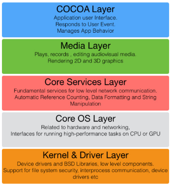
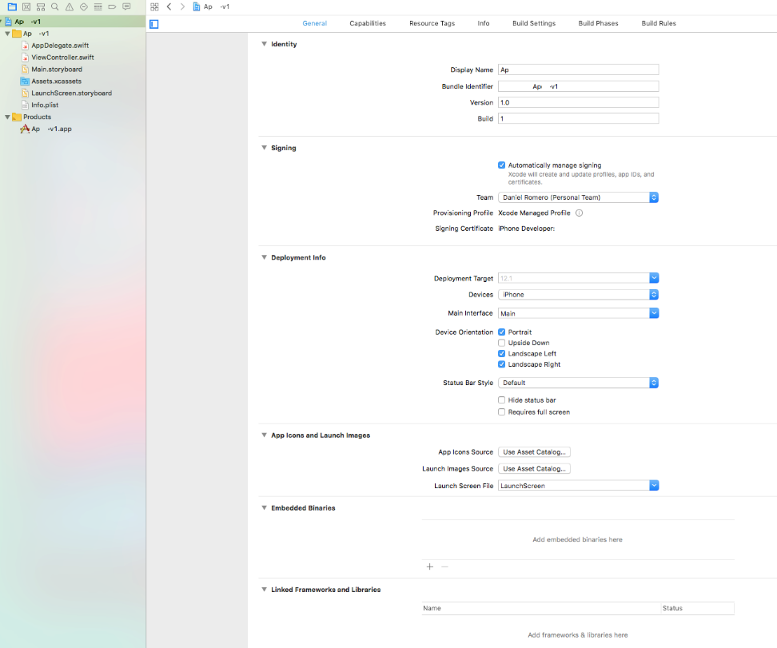

- [Highlights](#highlights)
  - [Logo](#logo)
- [Comparing Terminology](#comparing-terminology)
  - [Swift vs C#](#swift-vs-c)
  - [Other Swift terminology](#other-swift-terminology)
  - [iOS and .NET Terminology](#ios-and-net-terminology)
  - [iOS and macOS Architectures](#ios-and-macos-architectures)
- [Basics](#basics)
  - [Commenting](#commenting)
  - [Guard Keyword](#guard-keyword)
  - [Type Casting](#type-casting)
  - [Print to Screen](#print-to-screen)
  - [Read from the Console](#read-from-the-console)
- [Arrays](#arrays)
- [Conditions](#conditions)
- [Classes & Generics](#classes--generics)
  - [Generics](#generics)
  - [Inheritance](#inheritance)
- [Looping](#looping)
- [Functions](#functions)
  - [Anonymous Functions](#anonymous-functions)
- [Access Control](#access-control)
- [Xcode](#xcode)
  - [Parts of Xcode](#parts-of-xcode)
  - [Xcode Tips](#xcode-tips)
  - [Shortcut Keys](#shortcut-keys)
- [File System](#file-system)
  - [Check if a directory exists](#check-if-a-directory-exists)
  - [Read File Contents](#read-file-contents)
- [Strings](#strings)
- [Error Handling](#error-handling)
- [Storyboards & UI Builder](#storyboards--ui-builder)
  - [Constraints](#constraints)
  - [Text Fields](#text-fields)
  - [ID Types](#id-types)
  - [Table View](#table-view)
  - [Scroll View](#scroll-view)
  - [Tables Cells](#tables-cells)
  - [Segues](#segues)
  - [Navigation Controller](#navigation-controller)
- [Databases](#databases)
  - [Core Data](#core-data)
- [Code Snippets](#code-snippets)
- [Annoyances](#annoyances)
- [Resources](#resources)
  - [General](#general)
  - [Best Practices](#best-practices)
  - [Authentication](#authentication)
- [Tutorials](#tutorials)
  - [Books](#books)


# Highlights

Top level highlights of developing with .NET vs iOS.

- Swift is a replacement for Objective-C. 
- Swift came out in 2014 and currently in version 5 as of 3/25/2019. You need latest version of macOS (Mojave) to run. 
- Swift can use the following UI Frameworks:
  - Cocoa for macOS
  - Cocoa Touch for iOS
- Null is Nil
- Semicolons are optional and generally not used
- Rather than always checking for nulls, ? and ?? symbols are used
- Parameter names are by default required when calling a function, unless using the _ symbol - upon declaration
- There’re no namespace keywords for organizing classes, but several design patterns to - simulate the same thing, one is have a class inside a class.
- There’s no new keyword when creating an object. Just called its constructor method.
- There’s no intermediate compilation as IL that runs in the .NET framework. The Swift - compiler turns it into an executable binary that runs natively by the OS. This generally - translates to faster performance.
- Xcode nowhere as robust as Visual Studio.
  - Auto Complete Not even close
  - Has as many quirks as Visual Studio, especially in the Interface Builder
- Lots of Swift code 1.0, 2.0, 3.0 in the wild that is not compatible with 4.0.
- To develop iOS apps, know the following:
  - Xcode
  - Swift
  - Cocoa Touch (combination of Foundation and UIKit)
  - SQLite
  - MVC
- **Package Managers**: 
  - https://cocoapods.org/  (platform can be buggy)
  - https://github.com/Carthage/Carthage 
  - Apple Package Manager: https://swift.org/getting-started/#using-the-package-manager 

## Logo

 


# Comparing Terminology

## Swift vs C# 
Not all terms are exactly equivalent. Some are in the vicinity.

|Syntax|Description|
|-|-|
| Swift | C# |
| Paragraph | Text |
| Swift	| C# |
| Closure |	Lambda |
| Protocol |	Interface |
| Class |	Class |
| Nil |	Null |
| No new keyword |	new keyword used when creating object |
| Type Inference |	Type Inference |
| No LINQ equivalent, but functionality can be emulated via the functions filter(), match(), and closures |Also, this: https://github.com/mythz/swift-linq-examples | LINQ |
| Access Control | Access Modifiers |


## Other Swift terminology
- https://developer.apple.com/library/archive/referencelibrary/GettingStarted/DevelopiOSAppsSwift/GlossaryDefinitions.html
- https://www.hackingwithswift.com/glossary


## iOS and .NET Terminology
Not all terms are exactly equivalent. Some are in the vicinity. Programming for the iPhone closer resembles programming a desktop app than web app. 


| iOS Development                                                                                                                | .NET Development                              |
|--------------------------------------------------------------------------------------------------------------------------------|-----------------------------------------------|
| CocoaPods, Carthage, Swift Package Manager                                                                                     | Nuget                                         |
| XCode                                                                                                                          | Visual Studio                                 |
| Cocoa Touch + UIKit                                                                                                            | WPF                                           |
| XIB                                                                                                                            | XAML                                          |
| Controller Action / Outlet                                                                                                     | Controller Action / Property                  |
| Swift Intermediate Language                                                                                                    | Intermediate Language                         |
| LLVM IR <br>https://swift.org/compiler-stdlib/                                                                                   | JIT compiled via .NET Runtime                 |
| Storyboard (in XIB)                                                                                                            | View (in XAML)                                |
| Xcode Project File                                                                                                             | Visual Studio Project File                    |
| Xcode Workspace <br>More info about workspaces: https://developer.apple.com/library/archive/featuredarticles/XcodeConcepts/Concept-Workspace.html                                                                                                                | Visual Studio Solution                        |
| CoreData, SQLite, Realm<br>Comparison: https://rollout.io/blog/ios-databases-sqllite-core-data-realm/                           | Entity Framework, SQL Server Express, Local DB|                                                                           | Entity Framework, SQL Server Express, LocalDB |


## iOS and macOS Architectures

  

https://medium.com/@anuradhs/ios-architecture-a2169dad8067 


For Comparison, here’s the macOS Architecture 

http://www.knowstack.com/cocoa-layered-architecture-for-mac-osx/ 


  


More details here: https://en.wikipedia.org/wiki/Architecture_of_macOS

# Basics

## Commenting 

**Commenting out the printing of “Hello World.”**

```swift
// print("Hello World")
/* 
Hi there.
*/
```

**Declaring a variable**

```swift
var n: Int

var firstName: String? // Optional
var lastName: String = "" // Not optional, but set to Empty String
```

**Declaring an optional (we say this is wrapped) variable (“nullable” in C# terms)**

```swift
var n1: Int?
```

**Declaring an optional variable and assigning to 2600**

```swift
var n3: Int? = 2600
```

Declaring an optional variable and assigning to nil (null)

```swift
var total: Int? = nil
```

Declaring a Constant

```swift
let magic = 2600
```

Coalescing 3 variables (wrapped)

```swift
var n1: Int?
var n2: Int?
var n3: Int? = 2600

var total = n1 ?? n2 ?? n3
print(total)
```

Which prints out in the console:

```
Optional(2600)
```


## Guard Keyword

Helpful when inside a function – used when setting a constant or variable; if the attempt to set goes awry, then it lets you break out early. Imagine the following inside a function:

```swift
guard let jsonData = data else { return }
```

So if jsonData was not able to be set, then it returns (breaks out of the function).

To learn more:
 - https://www.hackingwithswift.com/new-syntax-swift-2-guard 
 - https://www.youtube.com/watch?v=nQ9dKwi57PI 

## Type Casting

https://medium.com/@abhimuralidharan/typecastinginswift-1bafacd39c99  

Conditional downcasting (as?).

Forced downcasting (as!).

```swift
let animalObj = livingBeingArray[0] as! Animal // forced downcasting to Animal
let humanObj = livingBeingArray[1] as! Human // forced downcasting to Human

```

## Print to Screen

To print out the actual value, you have to unwrap the variable total with the symbol !

```swift
print(total!)
```

## Read from the Console

```swift
var firstName: String? // Optional
var lastName: String = "" // Not optional, but set to Empty String

print ("What's your first name?")
firstName = readLine()

print ("What's your last name?")
lastName = readLine() ?? ""

print("Your info:")
print( (firstName ?? "") + " " + lastName)
```

# Arrays

**Declaring**

```swift
var array1 = ["peter", "parker", "spider-man"]

var array2 = [String]()
array2.append("eddie")
array2.append("brock")
array2.append("venom")

print(array2[1])
```


# Conditions

**No parenthesis is needed (optional) around condition.**


```swift
var array1 = ["peter", "parker", "spider"]
if array1.contains("man") || array1.count < 3 {
  print("contains man")
}
else{
  print("doesn't contain man")
}
```

The same symbols for comparison can be used in Swift: ==, !=, <=, >=, >, <, !

# Classes & Generics

**Creating a class with a constructor. You use the reserved init() method**

```swift
class BankAccount {
  var firstName: String  
  init(fn: String) {
    self.firstName = fn
  }
}
```

**Let’s create an array of BankAccounts**

```swift
var arrayOfBankAccounts = [BankAccount]()
```

## Generics

**Here’s another way. Let’s use the class as part of a Generic**

```swift
var list = Array<BankAccount>()
list.append(BankAccount(firstName: "Parker"))
print(list[0].firstName)
```


**Creating and calling it inline:**

```swift
class BankAccount{
  var Total: Int?
  init(total: Int?) {
    self.Total = total!
  }
}

print((BankAccount).init(total: 50).Total!)
```


**Another example of Generics**

```swift
class BankAccount {
  var firstName: String
  
  init(firstName: String) {
    self.firstName = firstName
  }
}

class Person<T> {
  var BA: T?
  var serialNumber = 2600
  
  init(ba: T) {
    self.BA = ba
  }
}

var smBankAccount = BankAccount(firstName: "Peter")
var o = Person<BankAccount>(ba: smBankAccount)

print(o.BA!.firstName)
```


## Inheritance

```swift
class SomeSubclass: SomeSuperclass {
  // subclass definition goes here
}
```


**Overriding Method**

```swift
class Train: Vehicle {
  override func makeNoise() {
    print("Choo Choo")
  }
}
```


# Looping

**Various examples:**

```swift
for i in 0..<10 {
  print(i)
}

var i = 1
while i <= 10 {
  print(i)
  i = i + 1
}

for i in 1...10 {
  print(i)
}

// Don’t need to have iteration variable, 
for _ in 1..<n {
  returnValue += String(total!) + " "
}
```


**Loop through array of words (splits string into array)**

```swift
var wordsAsString = "Peter Parker Likes Spider-Man"
var wordsAsArray = wordsAsString.split(separator: " ", maxSplits: 999, omittingEmptySubsequences: true)

for word in wordsAsArray {
  print(word)
}
```

# Functions

**Let’s add two numbers and return its sum:**

```swift
func addtwo(n1: Int, n2: Int) -> Int {
  return n1+n2
}

print(addtwo(n1: 50, n2: 60))
```


**Pass an array and print it out to screen**

```swift
func print_first_index(numbers: [Int], index: Int) {  
  if(index < numbers.count) {
    print(numbers[index])
  }
  else {
    print("index out of range")
  }  
}

print_first_index(numbers: [334,564,24], index: 2)
```


**Let’s make a function that accepts an array of Strings and foreaches names. TAKE NOTE: there’s no parenthesis after the for keyword.**

```swift
func showNames(names: [String]) {
  for name in names {
    print(name)
  }
}
```

## Anonymous Functions

**Passing an anonymous function and running that inside a function.**

```swift
// Let's pass in a function and immediately
// run that function.
func runIt(myFunction:()-> Void) {
  myFunction()
}

runIt(myFunction: ({
  print("I'm Batman")
}))
```


**Passing an Anonymous function into a Function that accepts a function**

```swift
func appendTitle(prefix: String, lastName: String, getLastName:(_ lastName: String)-> String) {
  let returnValue = prefix + " " + getLastName(lastName)
  print(returnValue)
}

appendTitle(prefix: "Mr.", lastName: "Parker", getLastName: { (lastName) in return lastName  })
```


**Passing a function name as parameter**

```swift
// Let's pass in a function and immediately
// run that function.
func appendTitle(prefix: String, lastName: String, getLastName:(_ lastName: String)-> String) {
  let returnValue = prefix + " " + getLastName(lastName)
  print(returnValue)
}


func GetLastName(lastName: String) -> String {
  return lastName
}

appendTitle(prefix: "Mr.", lastName: "Parker", getLastName: GetLastName)
```


```swift
// This accepts function that returns a string
func RunIt(f: () -> String) {
  print(f())
}

// Pass an anonymous function that has no parameter
// but returns a string
RunIt(f: {
  () in return "Yay this worked"}
)
```

**Now let’s create functions and parameters that have parameters:**

```swift
// This accepts function that returns a string
func RunIt(f: (_ firstName: String, _ lastName: String) -> String) {
  let firstName = "Peter"
  let lastName = "Parker"
  let fullNameWithTitle = "Mr. " + f(firstName, lastName)
  print(fullNameWithTitle)
}

// Pass an anonymous function that has no parameter
// but returns a string
RunIt(f: {
  (firstName, lastName) in
    var fullName: String
    fullName = firstName + " " + lastName
    return fullName
})
```


**Another example:**

```swift
var list = [12,54,32,234]

var filteredList = list.filter { (x) -> Bool in
  return x > 50

}

var doesItContain = list.contains{ (x) -> Bool in
  return x == 14
}

// No parenthesis around x
var doesItContain = list.contains{ x -> Bool in
  return x == 14
}


// Returns False
print(doesItContain)
```

# Access Control

```swift
public class BankAccount{
  var Total: Int?
  init(total: Int?) {
    self.Total = total!
  }
  
  private func showNTimes(n: Int, total: Int?) -> String {
    var returnValue = ""
    for _ in 1..<(n+1) {
      returnValue += String(total!) + " "
    }
    return returnValue
  }
  
  public func showTotal(n: Int) {
    print(ba.showNTimes(n: n, total: self.Total!))
  }
}

var ba = BankAccount(total: 2600)
ba.showTotal(n: 1)
```


# Xcode

This is the official Mac IDE to develop software in: C/C++/Objective-C and Swift for macOS, AppleTV, AppleWatch, iPhone and iPad.

Here’s a screenshot of the IDE while working on an app:

  


## Parts of Xcode

Here’s an overview of what some of the panels mean, and how they compare to Visual Studio (VS):

**Solution Explorer**
This would be VS’s solution explorer. The blue icon Project-v1 would be the project file, the orange folder would be the source code directory. The blue folder Assets.xcassets is a packaged file that houses all images (in most cases). 

The Products folder that has the .app file would be the /bin folder. 
>

**Properties**
When you have the project file selected, you can see its properties. This would be like in VS right-clicking on the project file and inspecting properties.
>  

**XIB Hierarchy**
This view is a visual hierarchy of what the XAML would like like. In this case, it’s XIB (XML Interface Builder) markup. 
>  

**Assets**
This view lets you inspect what is in the Assets directory. 
>  

**Storyboard**
Here’s the Interface Builder’s toolbox, that has all fields you can drag and drop on your storyboard. 
>  

**Second Tab**
The second tab for the project properties. It defines what capabilities your app will have – depending on what you choose, for example, it’ll prompt you if you want to allow geolocation services. 
>  

**XIB Markup Code**
The actual markup code of the XIB file.
>


## Xcode Tips

Will give you hints:
 
  


## Shortcut Keys

In the Storyboard Builder: ALT+D = Duplicate any form element

How to trigger an image literal:
- https://stackoverflow.com/questions/40884986/assign-image-to-annotation-instead-of-pin 


# File System

## Check if a directory exists

```swift
import Foundation

let f = FileManager()

if f.currentDirectoryPath == "/Users/daniel.ropbmffkbvctadgdqbonzjls/Build" {
  print("file exists")
}
else {
  print("doesn't exist")
}
```


## Read File Contents

```swift
import Foundation

let fileNamePath = "/Users/daniel.romero/Library/Developer/Xcode/DerivedData/HelloThere-hjkkkipbmffkbvctadgdqbonzjls/Build/Products/Debug/Names.txt"
let urlToFile = URL(fileURLWithPath: fileNamePath)

var contents = ""

do {
  contents = try String(contentsOf: urlToFile)
}
catch {
  print("Failed reading from URL: \(fileNamePath), Error: " + error.localizedDescription)
}

print(contents)
```


# Strings

- https://useyourloaf.com/blog/swift-string-cheat-sheet/		
- https://docs.swift.org/swift-book/LanguageGuide/StringsAndCharacters.html 


# Error Handling

**More info:**
- https://docs.swift.org/swift-book/LanguageGuide/ErrorHandling.html 
- https://stackoverflow.com/questions/32170456/what-does-fatal-error-unexpectedly-found-nil-while-unwrapping-an-optional-valu 

# Storyboards & UI Builder

Whatever UI is built from the UI Builder, can be done through pure code as well. Here are the benefits and drawbacks:

**Storyboards vs Code**
- https://www.youtube.com/watch?v=g6yz5oX5iWc 

**Storyboard vs Code SpeedRun - Which is Faster? (iOS Swift 4)**
- https://www.youtube.com/watch?v=bd2KSWLXo3A

But a lot can stem from Xcode being buggy with drag-dropping objects.


## Constraints

Every form field has constraints associated to it. For the most part, best practice is to give each constraint 4 properties (x/y, w/h). The following are a MUST WATCH:

- https://www.youtube.com/watch?v=7iT9fueKCJM    
- https://www.youtube.com/watch?v=m_0_XQEfrGQ 

## Text Fields

Styling a text field: https://medium.com/nyc-design/swift-4-add-icon-to-uitextfield-48f5ebf60aa1 


## ID Types

What are the differences between Restoration ID and identifier to a UITableViewCell that set in storyboard?

- https://stackoverflow.com/questions/37107972/what-are-the-differences-between-restoration-id-and-identifier-to-a-uitableviewc/37107989 
- https://developer.apple.com/library/archive/featuredarticles/ViewControllerPGforiPhoneOS/PreservingandRestoringState.html 

Restoration IDs are used for state restoration, i.e. making your view look like it did when you quit the app-often used for re-creating objects. Storyboard IDs, on the other hand, simply identify objects on the storyboard-these are often used for creating objects.

A restoration identifier is a string that you need to assign to any view controller or view that you want preserved and restored. During state preservation any view controllers or views in the view hierarchy that have a restoration identifier will be saved to disk.

The Identity in the Identity Inspector, are used to instantiate objects from Storyboard.

More details about the Reuse Identifier: https://stackoverflow.com/questions/30473833/what-is-the-purpose-of-the-reuseidentifier 


## Table View

Best tutorial on the Table View: https://www.youtube.com/watch?v=kCIQM7L-w4Y 

Typical boilerplate for implementing a Table View:

```swift
import UIKit

class ViewController: UIViewController, UITableViewDataSource {

  @IBOutlet weak var danTableView: UITableView!      
  private var data: [String] = []      
  
  override func viewDidLoad() {
    super.viewDidLoad()

    for i in 0...100 {
      data.append("\(i)")
    }        
    danTableView.dataSource = self;
  }

  func tableView(_ tableView: UITableView, numberOfRowsInSection section: Int) -> Int {
    return data.count
  }
  
  func tableView(_ tableView: UITableView, cellForRowAt indexPath: IndexPath) -> UITableViewCell {
    let cell = tableView.dequeueReusableCell(withIdentifier: "MyCell")!        
    let text = data[indexPath.row]        
    cell.textLabel?.text = text        
    return cell
  }
}
```

## Scroll View

- https://www.youtube.com/watch?v=nfHBCQ3c4Mg

## Tables Cells

- https://www.youtube.com/watch?v=FtO5QT2D_H8&t=1s  
- https://www.youtube.com/watch?v=RAFsNJ-qjsg

## Segues 

This is one method of navigating from View to View. You can create a segue through the Interface builder and control the flow through code:

```swift
let storyboard = UIStoryboard(name: "Main", bundle: nil)

let secondVC = storyboard.instantiateViewController(withIdentifier: "SecondViewController") as! SecondViewController

self.navigationController?.pushViewController(secondVC, animated: true)
```

**To learn more, watch:** 

- https://www.youtube.com/watch?v=WqZhXfWe_oY 
- https://www.youtube.com/watch?v=uPlZob19d7I       
- https://stackoverflow.com/questions/27604192/ios-how-to-segue-programmatically-using-swift     
- https://stackoverflow.com/questions/18947328/conditional-segue-using-storyboard/23073175 


## Navigation Controller

Object that surrounds your views and gives them navigation capabilities: 
- https://www.youtube.com/watch?v=unaf817uNtQ    

Related to this is also the UI Tab Bar (also using new storyboards to organize tab bars):
- https://www.youtube.com/watch?v=n7NNAdaIDKQ 

Navigation Bar Controller
- https://www.youtube.com/watch?v=erUWj0gOb7k 


# Databases

iOS apps typically don’t connect directly to external databases like SQL Server. For security purposes, they communicate with databases through endpoints on some server via JSON/XML. This doesn’t mean that they don’t use a database though. When the app is closed or the iPhone is reset, data must be persisted. Natively, iOS uses SQLite. While Swift can access SQL Lite, connecting to it can be cumbersome through a C interface. 

To make things easier, Apple made an ORM that runs on top of SQL Lite called Core Data.

## Core Data

More info on Core Data
- https://www.youtube.com/watch?v=PMze4tT2w_U
- https://medium.com/xcblog/core-data-with-swift-4-for-beginners-1fc067cca707 
- https://medium.com/@mczachurski/server-side-swift-object-relational-mapping-orm-68879d9a1aa3 

Safari Books Online : video - What is Core Data?
- https://learning.oreilly.com/videos/databases-core-data/9781838555207/9781838555207-video1_5


Core Data Best Practices
•	https://davedelong.com/blog/2018/05/09/the-laws-of-core-data/ 


# Code Snippets

Dismiss Keyboard When tapping anywhere 
https://freakycoder.com/ios-notes-31-how-to-hide-keyboard-by-touching-anywhere-cdf4f0c5151c 

Accessing a JSON Web Service

```swift
// This GOES INSIDE ViewController
import UIKit

// https://www.letsbuildthatapp.com/course_video?id=1562
struct Course: Decodable {
    let id: Int?
    let name: String?
    let link: String?
    let imageUrl: String?
}

class ViewController: UIViewController {
  override func viewDidLoad() {
    super.viewDidLoad()
    
    let jsonUrlString = "https://api.letsbuildthatapp.com/jsondecodable/courses_missing_fields"
    guard let url = URL(string: jsonUrlString) else { return }
    
    URLSession.shared.dataTask(with: url) { (data, response, err) in
      guard let jsonData = data else { return }
    
      do {
        let courses = try JSONDecoder().decode([Course].self, from: jsonData)
        courses.forEach( {
          w in print(w.imageUrl ?? "<not found>")
        })
          
      } catch let jsonErr {
          print("Error serializing json:", jsonErr)
      }
    }.resume()
  }
}
```


 
# Annoyances

Compiler complains that class does not exist. Unknown class in Interface Builder file:
https://stackoverflow.com/questions/24924966/xcode-6-bug-unknown-class-in-interface-builder-file 


# Resources

## General 
- https://learnswift.tips/ 

- A curated list of awesome iOS frameworks, libraries, tutorials, Xcode extensions and plugins, components and much more:
https://github.com/vsouza/awesome-ios

## Best Practices
- https://stackoverflow.com/questions/3443792/change-how-home-and-end-keys-work-in-xcode 
- https://docs.swift.org/swift-book/LanguageGuide/TheBasics.html 


## Authentication

**Firebase**
- https://medium.com/@ashikabala01/how-to-build-login-and-sign-up-functionality-for-your-ios-app-using-firebase-within-15-mins-df4731faf2f7
- https://firebase.google.com/ 
- https://stackoverflow.com/questions/9448632/best-practices-for-ios-applications-security?noredirect=1&lq=1
- https://stackoverflow.com/questions/40422714/swift3-how-to-protect-secret-key/40423579#40423579
- https://stackoverflow.com/questions/9181186/secure-https-encryption-for-iphone-app-to-webpage
- https://stackoverflow.com/questions/29760216/in-ios-how-can-i-store-a-secret-key-that-will-allow-me-to-communicate-with-my


# Tutorials

**Basics**

- https://www.weheartswift.com/ 

- **LinkedInLearning (Lynda.com) Courses**
  - Course: iOS 12 Development Essential Training: 1 Fundamentals, UI, and Architecture
  - Xcode 10 Essential Training 

- **YouTube**
  - Swift – Build Your First App in 30 minutes
  https://www.youtube.com/watch?v=aiXvvL1wNUc  

  - Installing a Cocoapod
    https://www.youtube.com/watch?v=MuMZZtQpB6Y  

  - Using CocoaPods, Installing, Updating
  https://guides.cocoapods.org/using/using-cocoapods.html 

**Package Managers**
- https://medium.com/xcblog/carthage-or-cocoapods-that-is-the-question-1074edaafbcb 
- https://github.com/Carthage/Carthage 
- Swift Package Manager (Official Apple)

**Swift**
- https://en.wikipedia.org/wiki/Swift_(programming_language) 
- https://docs.swift.org/swift-book/GuidedTour/GuidedTour.html 

**Cocoa**
- https://en.wikipedia.org/wiki/Cocoa_Touch 
- https://en.wikipedia.org/wiki/Cocoa_(API) 
- https://stackoverflow.com/questions/2297841/cocoa-versus-cocoa-touch-what-is-the-difference 


**Changing Keys on XCode and Mac as a Whole**
- https://stackoverflow.com/questions/3443792/change-how-home-and-end-keys-work-in-xcode 
- https://apple.stackexchange.com/questions/16135/remap-home-and-end-to-beginning-and-end-of-line 

**Structs in Swift for Newbies**
- https://medium.com/ios-os-x-development/structs-in-swift-for-newbies-bf64f3d40f68 
- https://medium.com/ios-os-x-development/classes-in-swift-for-newbies-529145228ba 

**Generics**
- https://medium.com/developermind/generics-in-swift-4-4f802cd6f53c 
- https://docs.swift.org/swift-book/LanguageGuide/Generics.html 

**Extensions + Helpful Libraries**
- https://github.com/theswiftdev/awesome-xcode-extensions 
- https://github.com/matteocrippa/awesome-swift
- https://github.com/SwifterSwift/SwifterSwift

**Best Practices + Guidelines**
- https://swift.org/documentation/api-design-guidelines/ 
- https://github.com/eure/swift-style-guide 
- https://google.github.io/swift/ 
- https://www.toptal.com/swift/tips-and-practices 
- https://www.swiftbysundell.com/posts/structuring-swift-code 
- https://github.com/raywenderlich/swift-style-guide 
- https://medium.com/@spmandrus/basics-swift-best-practices-175c21631aad 
- https://theswiftdev.com/2019/01/02/the-ultimate-swift-developer-toolset/ 

**Swift Code Highlighter (for this document)**
- http://pygments.org/

**Free App Icons**
- https://icons8.com/icons/ 
- https://thenounproject.com/ 

**Non-related Productivity Tools**
- https://apple.stackexchange.com/questions/94755/right-click-create-a-new-text-file-how
- http://www.keyboardmaestro.com/main/ 


## Books

|Book|Description|
|-|-|
||https://www.amazon.com/Swift-Pocket-Reference-Programming-iOS/dp/1491940077|
||https://www.amazon.com/iOS-12-Programming-Fundamentals-Swift/dp/1492044555|